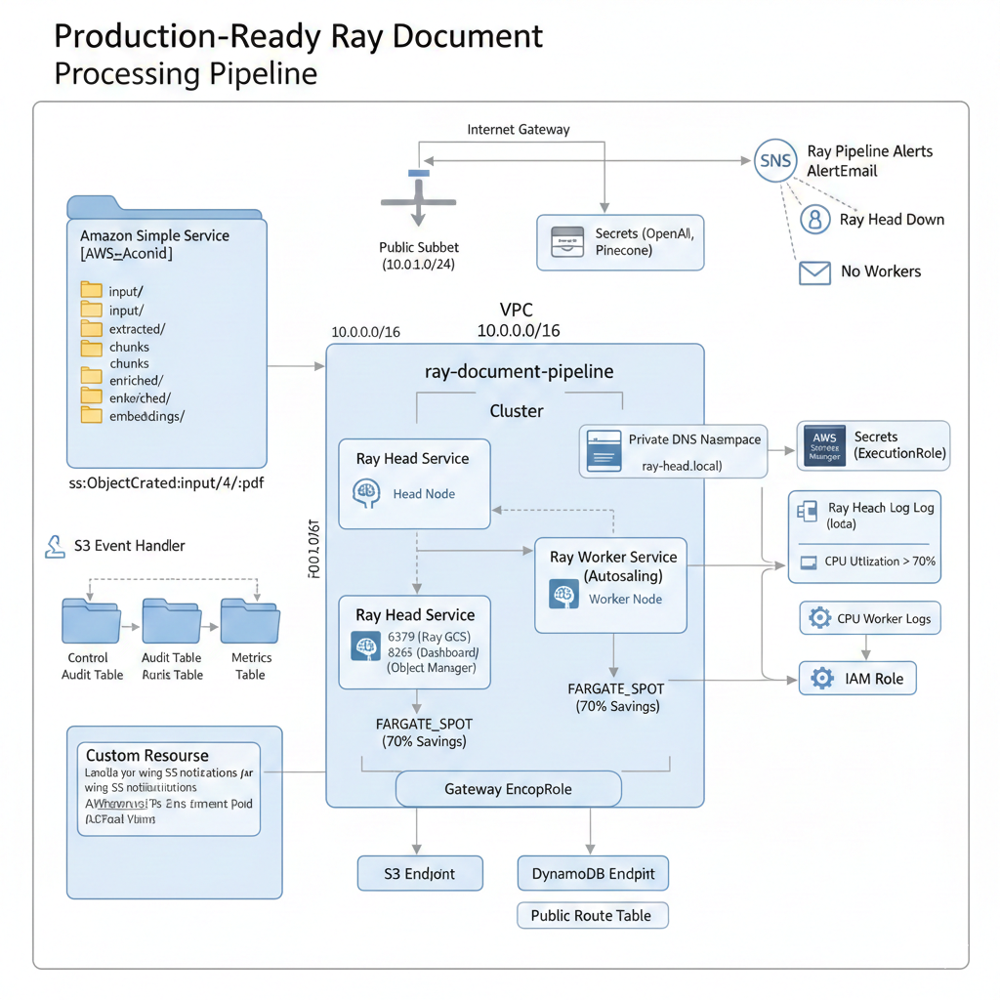

# CloudFormation Template — Complete Line-by-Line Explainer

This document walks through every section of `1_ray-pipeline-cloudformation-public.yaml` and explains what it does, why it exists, and what each field means. Written for students who are reading a CloudFormation template for the first time.

---

## What is a CloudFormation Template?

A CloudFormation template is a **blueprint written in YAML** that tells AWS exactly what infrastructure to build. Instead of clicking through the AWS Console to create a VPC, then a subnet, then a security group, then an ECS cluster — you write it all in one file and AWS builds everything automatically, in the right order, in about 10-15 minutes.

Every template has the same top-level sections:

```
AWSTemplateFormatVersion  ← Which version of CloudFormation syntax we're using
Description               ← Human-readable description of the stack
Parameters                ← Inputs you can customise at deploy time
Conditions                ← Boolean switches (if/else logic)
Resources                 ← The actual AWS resources to create  ← most of the file
Outputs                   ← Values to print after deployment (URLs, names, ARNs)
```

---

## Template Header

```yaml
AWSTemplateFormatVersion: '2010-09-09'
Description: 'Production-Ready Ray Document Processing Pipeline...'
```

**`AWSTemplateFormatVersion`** — Always `'2010-09-09'`. This is the only valid value. It tells AWS which version of the CloudFormation syntax the file uses. You will always write this exact string — it has never changed.

**`Description`** — A plain-English label that appears in the AWS Console under the stack name. Purely informational — AWS does not use it for anything technical.

---

## Section 1 — Parameters

```yaml
Parameters:
  VpcCIDR:
    Type: String
    Default: 10.0.0.0/16
    Description: CIDR block for the VPC
```

**What Parameters are:** Think of Parameters as **function arguments** for your template. Instead of hard-coding values like IP ranges and CPU sizes into the template, you define them here as named inputs. When you deploy, you pass in a `cloudformation-parameters.json` file that fills these in. This lets you reuse the same template for development, staging, and production by just changing the parameter values.

**Fields on every parameter:**

| Field | Meaning |
|---|---|
| `Type` | Data type — `String`, `Number`, or `AWS::SSM::Parameter::Value<String>` etc. |
| `Default` | Used if you don't provide a value in your parameters file |
| `Description` | Shows up in the AWS Console to help the user understand what to enter |
| `AllowedValues` | Whitelist — CloudFormation rejects any value not in this list |
| `MinValue` / `MaxValue` | Numeric bounds — rejects values outside the range at deploy time |

### Network Configuration Parameters

```yaml
VpcCIDR:
  Type: String
  Default: 10.0.0.0/16
```
**What it means:** The IP address range for the entire VPC. `10.0.0.0/16` means "all IPs from 10.0.0.0 to 10.0.255.255" — 65,536 addresses. The `/16` is the subnet mask — a smaller number means more IPs. You rarely need to change this unless you're connecting to other VPCs with overlapping ranges.

```yaml
PublicSubnetCIDR:
  Type: String
  Default: 10.0.1.0/24
```
**What it means:** The IP range for the single public subnet inside the VPC. `10.0.1.0/24` means "IPs from 10.0.1.0 to 10.0.1.255" — 256 addresses. This is a subset of the VPC CIDR. `/24` is the typical size for a single subnet — 256 addresses is more than enough for a Ray cluster.

### S3 Configuration

```yaml
S3BucketName:
  Type: String
  Default: ray-document-pipeline
  Description: S3 bucket name (will append account ID for uniqueness)
```
**What it means:** The base name for your S3 bucket. The template appends your AWS Account ID automatically, so the real bucket name becomes `ray-document-pipeline-107282186797`. This guarantees global uniqueness — S3 bucket names are shared across all AWS accounts worldwide, so two people can't have a bucket with the exact same name. You should change this to something personal like `ray-pipeline-prudhvi-2026`.

### Ray Cluster Configuration

```yaml
RayHeadCPU:
  Type: Number
  Default: 2048
  AllowedValues: [1024, 2048, 4096]
```
**What it means:** How much CPU to give the Ray head container. In ECS Fargate, CPU is measured in **CPU units** where `1024 units = 1 vCPU`. So `2048 = 2 vCPU`. The `AllowedValues` constraint means CloudFormation will reject `3000` at deploy time — you must choose 1, 2, or 4 vCPU.

> **Why only specific values?** Fargate uses fixed CPU/Memory combinations. You can't say "give me 1.5 vCPU" — Fargate only offers specific pairs. `AllowedValues` prevents you from accidentally entering an invalid combination that would make the task definition fail.

```yaml
RayHeadMemory:
  Type: Number
  Default: 4096
  AllowedValues: [2048, 4096, 8192]
```
**What it means:** Memory for the Ray head in **megabytes**. `4096 MB = 4 GB`. The head node runs both Ray itself and the orchestrator Python script, so it needs more memory than a worker. Valid Fargate memory values for 2 vCPU are 4 GB, 8 GB, or 16 GB.

```yaml
RayWorkerCPU:
  Type: Number
  Default: 2048
RayWorkerMemory:
  Type: Number
  Default: 4096
```
**What it means:** Same as head but for each worker container. Workers do the actual heavy lifting (PDF extraction, chunking, embedding) so they can be the same size or smaller depending on your workload. With 10 PDFs for a demo, `1 vCPU / 4 GB` per worker is sufficient.

### Auto-Scaling Configuration

```yaml
MinWorkers:
  Type: Number
  Default: 1
  MinValue: 0
  MaxValue: 10
```
**What it means:** The minimum number of Ray worker containers to keep running at all times. Setting this to `1` means there is always at least one worker ready — no cold-start delay when documents arrive. Setting to `0` would save money when idle but means the first document waits for a container to spin up (~60 seconds).

```yaml
MaxWorkers:
  Type: Number
  Default: 10
  MinValue: 1
  MaxValue: 50
```
**What it means:** The ceiling for auto-scaling. No matter how busy the pipeline gets, it will never create more than 10 worker containers. This is a cost guard — without it, a flood of uploads could spin up 100 containers and run up a huge bill.

```yaml
TargetCPUUtilization:
  Type: Number
  Default: 70
```
**What it means:** The CPU % that triggers scaling. When average worker CPU exceeds 70%, auto-scaling adds more workers. When it drops below 70%, workers are removed. `70%` is a standard production value — high enough to use capacity efficiently but leaves 30% headroom for traffic spikes.

### Container Image

```yaml
ECRImageUri:
  Type: String
  Description: ECR image URI (e.g., 123456789.dkr.ecr.us-east-1.amazonaws.com/ray-pipeline:latest)
```
**What it means:** The full Docker image address in Amazon ECR (Elastic Container Registry). This is the container image that gets deployed to both the head and worker ECS tasks. The `check_prerequisites.py` script builds this image and fills this value in automatically. Format is always: `<AccountId>.dkr.ecr.<Region>.amazonaws.com/<RepoName>:<Tag>`.

### Secrets

```yaml
OpenAISecretArn:
  Type: String
  Description: ARN of OpenAI API key in Secrets Manager

PineconeSecretArn:
  Type: String
  Description: ARN of Pinecone API key in Secrets Manager
```
**What they mean:** ARNs (Amazon Resource Names) pointing to API keys stored in AWS Secrets Manager. An ARN is a unique identifier for any AWS resource — format: `arn:aws:secretsmanager:us-east-1:107282186797:secret:ray-pipeline-openai-6rzhmk`. The ECS containers fetch the actual key value at runtime using this ARN. **The key itself is never written into the template** — only the ARN reference. This is the secure way to handle secrets in AWS.

### Alerts

```yaml
AlertEmail:
  Type: String
  Default: ""
```
**What it means:** An optional email address to receive CloudWatch alarm notifications. If you leave this empty, no emails are sent. If you set it to `your@email.com`, you'll get emails when the Ray head goes down or workers hit maximum capacity.

### Environment

```yaml
Environment:
  Type: String
  Default: production
  AllowedValues: [development, staging, production]
```
**What it means:** A label applied as a tag to every resource. Helps you identify resources when you have multiple stacks (dev, staging, prod) in the same AWS account. The value appears in the AWS Console next to each resource. Has no functional impact — purely organisational.

### Cost Optimization

```yaml
UseFargateSpot:
  Type: String
  Default: "true"
  AllowedValues: ["true", "false"]
```
**What it means:** Whether to use **Fargate Spot** for worker containers. Spot capacity is unused AWS compute sold at a 70% discount. The tradeoff is that AWS can reclaim Spot instances with 2 minutes notice. For our pipeline this is safe — workers are stateless and if one is interrupted mid-document, the orchestrator will re-queue it.

---

## Section 2 — Conditions

```yaml
Conditions:
  HasAlertEmail: !Not [!Equals [!Ref AlertEmail, ""]]
  UseFargateSpot: !Equals [!Ref UseFargateSpot, "true"]
```

**What Conditions are:** Boolean expressions evaluated at deploy time. They work like `if` statements — resources and properties can say `!If [ConditionName, value_if_true, value_if_false]`.

### CloudFormation Intrinsic Functions used here

| Function | What it does |
|---|---|
| `!Ref ParameterName` | Gets the value of a parameter |
| `!Equals [a, b]` | Returns `true` if a equals b |
| `!Not [expr]` | Inverts a boolean |
| `!If [condition, true_value, false_value]` | Conditional value |
| `!Sub 'string ${Variable}'` | String interpolation — substitutes variable values |
| `!GetAtt Resource.Attribute` | Gets a specific attribute of a resource (e.g., its ARN) |
| `!Select [index, list]` | Picks one item from a list |
| `!GetAZs 'region'` | Returns list of Availability Zones in a region |

**`HasAlertEmail`** — Evaluates to `true` if `AlertEmail` is not an empty string. Used to conditionally create the SNS topic (only needed if someone wants email alerts) and attach alarm actions.

**`UseFargateSpot`** — Evaluates to `true` if the `UseFargateSpot` parameter is the string `"true"`. Used in the worker ECS service to switch between Spot and on-demand capacity.

---

## Section 3 — Resources: Networking

This is where the actual AWS infrastructure begins. Resources are the heart of the template.

Every resource block follows this pattern:
```yaml
LogicalName:          ← Name used to reference this resource elsewhere in the template
  Type: AWS::Service::ResourceType
  DependsOn: OtherResource   ← Optional: wait for this before creating me
  Properties:
    Key: Value
```

### VPC

```yaml
VPC:
  Type: AWS::EC2::VPC
  Properties:
    CidrBlock: !Ref VpcCIDR
    EnableDnsHostnames: true
    EnableDnsSupport: true
    Tags:
      - Key: Name
        Value: !Sub '${AWS::StackName}-vpc'
```

**What a VPC is:** A Virtual Private Cloud — your own isolated network inside AWS. Think of it as renting a private section of the internet. Everything you create (ECS containers, DynamoDB, Lambda) lives inside this network unless you explicitly make it accessible from outside.

**`CidrBlock: !Ref VpcCIDR`** — Sets the IP address range using the parameter we defined. `!Ref VpcCIDR` means "look up the value of the VpcCIDR parameter."

**`EnableDnsHostnames: true`** — Allows ECS containers to have DNS names (like `ray-head.local`) instead of just IP addresses. **Required** for Service Discovery to work — workers find the head node by name, not IP.

**`EnableDnsSupport: true`** — Turns on the built-in AWS DNS resolver inside this VPC. Also required for Service Discovery. If this were false, `ray-head.local` would never resolve.

**`!Sub '${AWS::StackName}-vpc'`** — `!Sub` substitutes variables. `${AWS::StackName}` is a built-in CloudFormation variable that resolves to the stack name (e.g., `ray-document-pipeline`). So the tag value becomes `ray-document-pipeline-vpc`. This naming convention makes it easy to find resources in the AWS Console.

---

### Internet Gateway

```yaml
InternetGateway:
  Type: AWS::EC2::InternetGateway

AttachGateway:
  Type: AWS::EC2::VPCGatewayAttachment
  Properties:
    VpcId: !Ref VPC
    InternetGatewayId: !Ref InternetGateway
```

**What an Internet Gateway is:** The door between your VPC and the public internet. Without it, nothing inside the VPC can reach the internet and nothing on the internet can reach inside. Creating the gateway is not enough — you also need to **attach** it to a specific VPC, which is what `AttachGateway` does.

**Why two separate resources?** CloudFormation requires gateway creation and attachment as two steps. `!Ref VPC` and `!Ref InternetGateway` tell CloudFormation "use the IDs of the VPC and InternetGateway resources we just defined above." CloudFormation automatically creates them in the right order.

---

### Public Subnet

```yaml
PublicSubnet:
  Type: AWS::EC2::Subnet
  Properties:
    VpcId: !Ref VPC
    CidrBlock: !Ref PublicSubnetCIDR
    MapPublicIpOnLaunch: true
    AvailabilityZone: !Select [0, !GetAZs '']
```

**What a Subnet is:** A subdivision of the VPC's IP range. Resources are placed into subnets, not directly into VPCs. A public subnet is one where resources can have public IP addresses and communicate with the internet.

**`MapPublicIpOnLaunch: true`** — Any ECS container launched in this subnet automatically gets a public IP address. This is the key property that makes it a "public" subnet. Without this, containers would only have private IPs and couldn't reach the internet (for pulling Docker images, calling OpenAI, etc.) — unless you had a NAT Gateway. We use this to **avoid needing a NAT Gateway**, saving ~$32/month.

**`AvailabilityZone: !Select [0, !GetAZs '']`** — Places the subnet in the first Availability Zone of the current region. `!GetAZs ''` returns a list like `['us-east-1a', 'us-east-1b', 'us-east-1c']` and `!Select [0, ...]` picks the first one (`us-east-1a`). For a teaching demo with one subnet this is fine — production setups would use multiple AZs for redundancy.

---

### Route Table

```yaml
PublicRouteTable:
  Type: AWS::EC2::RouteTable
  Properties:
    VpcId: !Ref VPC

PublicRoute:
  Type: AWS::EC2::Route
  DependsOn: AttachGateway
  Properties:
    RouteTableId: !Ref PublicRouteTable
    DestinationCidrBlock: 0.0.0.0/0
    GatewayId: !Ref InternetGateway

PublicSubnetRouteTableAssociation:
  Type: AWS::EC2::SubnetRouteTableAssociation
  Properties:
    SubnetId: !Ref PublicSubnet
    RouteTableId: !Ref PublicRouteTable
```

**What a Route Table is:** The GPS of the VPC. It contains rules (routes) that say "if traffic is going to this address, send it this way." Every subnet needs a route table.

**`PublicRoute`** — The single most important rule: "send all traffic (`0.0.0.0/0` = everywhere) to the Internet Gateway." This is what makes internet access possible. Without this rule, containers cannot reach OpenAI or ECR even if they have public IPs.

**`DependsOn: AttachGateway`** — CloudFormation will wait until the gateway is attached to the VPC before creating this route. A route pointing to an unattached gateway would fail silently.

**`PublicSubnetRouteTableAssociation`** — Links the subnet to the route table. A subnet has no routes until it's associated with a route table that contains them.

---

### VPC Endpoints

```yaml
S3VPCEndpoint:
  Type: AWS::EC2::VPCEndpoint
  Properties:
    VpcId: !Ref VPC
    ServiceName: !Sub 'com.amazonaws.${AWS::Region}.s3'
    RouteTableIds:
      - !Ref PublicRouteTable
    VpcEndpointType: Gateway

DynamoDBVPCEndpoint:
  Type: AWS::EC2::VPCEndpoint
  Properties:
    VpcId: !Ref VPC
    ServiceName: !Sub 'com.amazonaws.${AWS::Region}.dynamodb'
    VpcEndpointType: Gateway
```

**What a VPC Endpoint is:** A private connection between your VPC and an AWS service that bypasses the public internet entirely. Without these, when an ECS container calls S3 or DynamoDB, the traffic goes: container → Internet Gateway → public internet → S3. With a Gateway Endpoint, it goes: container → VPC Endpoint → S3 (entirely inside AWS).

**Why this matters:**
- **Cost:** No data transfer charges for S3/DynamoDB traffic (free over endpoint, charged over internet)
- **Speed:** Traffic stays on AWS's private backbone — lower latency
- **Security:** No S3/DynamoDB traffic ever leaves AWS's network

**`VpcEndpointType: Gateway`** — The free type that works for S3 and DynamoDB specifically. It adds a route to the route table automatically. Interface endpoints (for other services) cost money — Gateway endpoints are free.

---

## Section 4 — Resources: Security Groups

```yaml
RayClusterSecurityGroup:
  Type: AWS::EC2::SecurityGroup
  Properties:
    GroupDescription: Security group for Ray cluster
    VpcId: !Ref VPC
```

**What a Security Group is:** A virtual firewall that controls what network traffic is allowed in (ingress) and out (egress) of resources. Every ECS container in the cluster uses this same security group.

Security group rules are defined as separate resources:

```yaml
RayGCSIngressRule:
  Type: AWS::EC2::SecurityGroupIngress
  Properties:
    GroupId: !Ref RayClusterSecurityGroup
    IpProtocol: tcp
    FromPort: 6379
    ToPort: 6379
    SourceSecurityGroupId: !Ref RayClusterSecurityGroup
```
**Port 6379 — Ray GCS (Global Control Store):** The Redis-based coordination port. Workers connect to the head node on this port to register themselves and receive task assignments. `SourceSecurityGroupId: !Ref RayClusterSecurityGroup` means "only allow traffic from other resources in the same security group" — workers can reach the head, but nothing outside the cluster can.

```yaml
RayDashboardIngressRule:
  Properties:
    FromPort: 8265
    ToPort: 8265
    CidrIp: 0.0.0.0/0
```
**Port 8265 — Ray Dashboard:** The web UI where you can see cluster status, running tasks, and resource usage. `CidrIp: 0.0.0.0/0` means "allow from anywhere on the internet." This is intentional for a teaching demo — students need to open it in their browsers. In production you'd restrict this to your office IP.

```yaml
RayObjectManagerIngressRule:
  Properties:
    FromPort: 10001
    ToPort: 10001
    SourceSecurityGroupId: !Ref RayClusterSecurityGroup
```
**Port 10001 — Ray Object Manager:** Used to transfer large data objects (like extracted PDF text) between nodes in the Ray cluster. Also restricted to cluster-internal traffic only.

```yaml
RayClusterEgressRule:
  Properties:
    IpProtocol: -1
    CidrIp: 0.0.0.0/0
```
**Egress (outbound):** `IpProtocol: -1` means "all protocols and all ports." `CidrIp: 0.0.0.0/0` means "to anywhere." This allows containers to make outbound calls to OpenAI, Pinecone, ECR for image pulls, and any other external service — unrestricted outbound is standard.

---

## Section 5 — Resources: S3 Bucket

```yaml
DocumentBucket:
  Type: AWS::S3::Bucket
  Properties:
    BucketName: !Sub '${S3BucketName}-${AWS::AccountId}'
```
**`!Sub '${S3BucketName}-${AWS::AccountId}'`** — Combines your chosen bucket name with your 12-digit AWS Account ID. For example: `ray-ingestion-prudhvi-2026-107282186797`. S3 bucket names must be globally unique across all AWS accounts worldwide, so appending AccountId (which is unique to you) guarantees no collision.

```yaml
    BucketEncryption:
      ServerSideEncryptionConfiguration:
        - ServerSideEncryptionByDefault:
            SSEAlgorithm: AES256
```
**What this means:** Every object uploaded to S3 is automatically encrypted at rest using AES-256. No action needed by the application — S3 handles encryption transparently. This is required by most data compliance frameworks (HIPAA, SOC2, GDPR) and has no performance impact.

```yaml
    VersioningConfiguration:
      Status: Enabled
```
**What Versioning means:** Every time you overwrite an object, S3 keeps the old version. If you accidentally upload a corrupted PDF and overwrite a good one, you can restore the previous version. It also protects against accidental deletion.

```yaml
    LifecycleConfiguration:
      Rules:
        - Id: DeleteExtractedAfter30Days
          ExpirationInDays: 30
          Prefix: extracted/
        - Id: DeleteChunksAfter30Days
          ExpirationInDays: 30
          Prefix: chunks/
        - Id: DeleteEmbeddingsAfter90Days
          ExpirationInDays: 90
          Prefix: embeddings/
        - Id: DeleteInputAfter180Days
          ExpirationInDays: 180
          Prefix: input/
```
**What Lifecycle Rules mean:** S3 automatically deletes objects after a certain number of days. The intermediate pipeline outputs (`extracted/`, `chunks/`, `enriched/`) are only needed during processing and become redundant once the vectors are in Pinecone. Deleting them after 30 days keeps storage costs near zero. The raw PDF inputs are kept for 180 days in case you need to reprocess.

```yaml
    PublicAccessBlockConfiguration:
      BlockPublicAcls: true
      BlockPublicPolicy: true
      IgnorePublicAcls: true
      RestrictPublicBuckets: true
```
**What this means:** All four settings block every possible way the bucket could accidentally become public. Even if someone runs `aws s3api put-bucket-acl --acl public-read`, it will be refused. Clinical trial data must never be publicly accessible — these four settings are the defence in depth.

### S3 Bucket Policy

```yaml
DocumentBucketPolicy:
  Type: AWS::S3::BucketPolicy
  Properties:
    PolicyDocument:
      Statement:
        - Sid: AllowECSTaskAccess
          Effect: Allow
          Principal:
            AWS: !GetAtt ECSTaskRole.Arn
          Action:
            - s3:GetObject
            - s3:PutObject
            - s3:DeleteObject
            - s3:ListBucket
```
**What a Bucket Policy is:** A resource-based policy attached to the bucket itself (in addition to the IAM role-based policy on the ECS tasks). The `Principal` is who is allowed — here it's the ECS Task Role. The ECS containers need to read PDFs, write intermediate files, and list bucket contents. `DeleteObject` is needed for the cleanup in `ray_tasks.py`.

---

## Section 6 — Resources: DynamoDB Tables

The pipeline uses three DynamoDB tables. DynamoDB is a fully managed NoSQL database — you define the schema, capacity mode, and indexes and AWS handles everything else.

### Control Table

```yaml
ControlTable:
  Type: AWS::DynamoDB::Table
  Properties:
    TableName: !Sub '${AWS::StackName}-control'
    BillingMode: PAY_PER_REQUEST
```
**Purpose:** The pipeline's state machine. One record per document, tracking its current status (`PENDING` → `IN_PROGRESS` → `COMPLETED` / `FAILED`).

**`BillingMode: PAY_PER_REQUEST`** — You pay per read/write operation, not for reserved capacity. For a teaching demo that processes 10 documents, this costs pennies. If you had millions of documents, you'd switch to `PROVISIONED` and reserve throughput for a lower per-operation cost.

```yaml
    PointInTimeRecoverySpecification:
      PointInTimeRecoveryEnabled: true
    SSESpecification:
      SSEEnabled: true
```
**PITR (Point-In-Time Recovery):** Lets you restore the table to any second within the last 35 days — like a continuous backup. If you accidentally delete all PENDING records, you can recover. **SSE:** Server-side encryption at rest — same concept as S3 encryption above.

```yaml
    KeySchema:
      - AttributeName: document_id
        KeyType: HASH
      - AttributeName: processing_version
        KeyType: RANGE
```
**What the Key Schema is:** DynamoDB's primary key definition. Every item is uniquely identified by the combination of `document_id` (HASH key, also called partition key) and `processing_version` (RANGE key, also called sort key). This composite key means you could have `doc_abc / v1` and `doc_abc / v2` as separate records — useful for reprocessing a document with updated pipeline logic.

```yaml
    GlobalSecondaryIndexes:
      - IndexName: status-updated-index
        KeySchema:
          - AttributeName: status
            KeyType: HASH
          - AttributeName: updated_at
            KeyType: RANGE
        Projection:
          ProjectionType: ALL
```
**What a GSI (Global Secondary Index) is:** An alternative index that lets you query the table by different attributes. The main table is indexed by `document_id`. The orchestrator's polling loop needs to find all `PENDING` documents — that's a query by `status`, not `document_id`. The GSI creates a separate index where `status` is the partition key, making this query fast (milliseconds) instead of doing a full table scan.

```yaml
    TimeToLiveSpecification:
      AttributeName: ttl
      Enabled: true
```
**What TTL means:** If an item has a `ttl` attribute set to a Unix timestamp in the past, DynamoDB automatically deletes it — for free. The Lambda sets `ttl` to 90 days from upload. This prevents the table from growing forever with old completed records.

### Audit Table

```yaml
AuditTable:
  Type: AWS::DynamoDB::Table
  Properties:
    TableName: !Sub '${AWS::StackName}-audit'
    KeySchema:
      - AttributeName: document_id
        KeyType: HASH
      - AttributeName: timestamp
        KeyType: RANGE
```
**Purpose:** An immutable event log. Every state change writes a new record — `DOCUMENT_RECEIVED`, `STAGE_1_COMPLETE`, `FAILED`, etc. Because `timestamp` is the sort key, you can query all events for a document sorted chronologically. Never updated in place — only appended to.

### Metrics Table

```yaml
MetricsTable:
  Type: AWS::DynamoDB::Table
  Properties:
    KeySchema:
      - AttributeName: date
        KeyType: HASH
      - AttributeName: metric_type
        KeyType: RANGE
```
**Purpose:** Daily aggregated statistics — how many documents processed, total pages extracted, total embedding tokens used, total cost. The primary key is `date + metric_type`, so you can query "all metrics for 2026-02-23" or "all CPU_USAGE records across dates."

---

## Section 7 — Resources: SNS Topic (Alerts)

```yaml
AlertTopic:
  Type: AWS::SNS::Topic
  Condition: HasAlertEmail
  Properties:
    TopicName: !Sub '${AWS::StackName}-alerts'
    Subscription:
      - Endpoint: !Ref AlertEmail
        Protocol: email
```

**What SNS is:** Simple Notification Service — a pub/sub messaging service. CloudWatch Alarms publish to this topic when they trigger, and SNS delivers the message to all subscribers (in this case, an email address).

**`Condition: HasAlertEmail`** — This entire resource is only created if `AlertEmail` is not empty. If you deploy with no email address, no SNS topic is created and no emails are sent. This is `Conditions:` in action — conditional resource creation.

---

## Section 8 — Resources: Lambda Function

```yaml
S3EventLambda:
  Type: AWS::Lambda::Function
  Properties:
    FunctionName: !Sub '${AWS::StackName}-s3-event-handler'
    Runtime: python3.12
    Handler: index.lambda_handler
    Timeout: 30
    MemorySize: 256
```

**Purpose:** The entry point for the entire pipeline. When a PDF is uploaded to `s3://bucket/input/`, S3 fires an event that invokes this Lambda. The Lambda creates a `PENDING` record in DynamoDB. The orchestrator picks it up and starts processing.

**`Runtime: python3.12`** — Lambda runs Python 3.12. The code is embedded directly in the template under `Code: ZipFile:`.

**`Timeout: 30`** — Lambda aborts after 30 seconds. A DynamoDB write should never take more than a second — if it does, something is seriously wrong and aborting is the right behaviour.

**`MemorySize: 256`** — 256 MB of RAM. Lambda CPU is proportional to memory — more memory = more CPU = faster execution. 256 MB is generous for a function that just writes to DynamoDB.

### Lambda Idempotency (Key Design Decision)

Inside the Lambda code:
```python
key_hash = hashlib.md5(key.encode()).hexdigest()[:8]
doc_id = f"doc_{filename}_{key_hash}"

control_table.put_item(
    Item={...},
    ConditionExpression='attribute_not_exists(document_id)'
)
```
**Why MD5 instead of timestamp?** S3 guarantees **at-least-once** delivery of events — the same upload can fire two events. If we used a timestamp-based ID, we'd create two `PENDING` records for the same PDF, and the pipeline would process it twice, creating duplicate vectors in Pinecone and double the API cost. The MD5 hash of the S3 key is always the same for the same file path. The `ConditionExpression='attribute_not_exists(document_id)'` makes the write only succeed if the record doesn't exist yet — the second event is silently ignored.

### S3 Notification (Circular Dependency Fix)

```yaml
DocumentBucketNotification:
  Type: AWS::S3::BucketNotification
  DependsOn: S3TriggerLambdaPermission
  Properties:
    Bucket: !Ref DocumentBucket
    NotificationConfiguration:
      LambdaConfigurations:
        - Event: s3:ObjectCreated:*
          Filter:
            S3Key:
              Rules:
                - Name: prefix
                  Value: input/
                - Name: suffix
                  Value: .pdf
```

**Why a separate resource instead of inside the bucket definition?** CloudFormation cannot create the S3 notification inside `DocumentBucket.Properties` because that creates a circular dependency: `DocumentBucket` needs `S3EventLambda.Arn` → but `S3EventLambda` needs permission to be invoked by `DocumentBucket.Arn` → which requires `DocumentBucket` to exist first. By separating the notification into its own resource with `DependsOn: S3TriggerLambdaPermission`, CloudFormation can sequence it safely.

**`Event: s3:ObjectCreated:*`** — Only fires for uploads (`PUT`, `POST`, `COPY`, multipart complete). Does not fire for reads or deletes.

**Filter rules** — Only fire for objects that:
- Have prefix `input/` (uploads to other folders like `extracted/` are ignored)
- Have suffix `.pdf` (images, text files, etc. are ignored)

---

## Section 9 — Resources: IAM Roles

IAM Roles define **what AWS services can do on your behalf**. Two separate roles are used — this is security best practice called **least privilege**.

### ECSTaskExecutionRole

```yaml
ECSTaskExecutionRole:
  Type: AWS::IAM::Role
  Properties:
    AssumeRolePolicyDocument:
      Statement:
        - Effect: Allow
          Principal:
            Service: ecs-tasks.amazonaws.com
          Action: sts:AssumeRole
    ManagedPolicyArns:
      - arn:aws:iam::aws:policy/service-role/AmazonECSTaskExecutionRolePolicy
    Policies:
      - PolicyName: SecretsAccess
        Action:
          - secretsmanager:GetSecretValue
```

**What this role is for:** Used by the **ECS agent** (AWS infrastructure) to set up the container before it starts. It needs to: pull the Docker image from ECR, write logs to CloudWatch, and inject secrets (OpenAI/Pinecone keys) as environment variables.

**`AssumeRolePolicyDocument`** — The trust policy. Says "the `ecs-tasks.amazonaws.com` service is allowed to assume (use) this role." Without this, nobody can use the role. `sts:AssumeRole` is the action that grants this.

**`AmazonECSTaskExecutionRolePolicy`** — An AWS managed policy that grants ECR pull and CloudWatch Logs write permissions. AWS maintains this policy — it always has the right permissions for ECS execution.

**`secretsmanager:GetSecretValue`** — The additional permission to read the OpenAI and Pinecone API keys from Secrets Manager and inject them as environment variables.

### ECSTaskRole

```yaml
ECSTaskRole:
  Type: AWS::IAM::Role
  Properties:
    Policies:
      - PolicyName: S3Access
        Action: [s3:GetObject, s3:PutObject, s3:DeleteObject, s3:ListBucket]
      - PolicyName: DynamoDBAccess
        Action: [dynamodb:PutItem, dynamodb:GetItem, dynamodb:UpdateItem,
                 dynamodb:Query, dynamodb:Scan, dynamodb:DescribeTable]
      - PolicyName: SecretsAccess
        Action: [secretsmanager:GetSecretValue]
      - PolicyName: CloudWatchLogs
        Action: [logs:CreateLogGroup, logs:CreateLogStream, logs:PutLogEvents]
```

**What this role is for:** Used by the **application code running inside the container** (ray_orchestrator.py, ray_tasks.py). It can read/write S3, read/write DynamoDB, and write logs.

**Why separate from ExecutionRole?** The execution role is for AWS infrastructure setup — it runs before your code starts. The task role is for your code at runtime. Mixing them would give your application code unnecessary permissions like ECR access.

**`dynamodb:DescribeTable`** — Required by `test_connections()` in the orchestrator, which calls `table.table_status` to verify the table exists before starting. Without this permission, the orchestrator crashes on startup with `AccessDeniedException`.

---

## Section 10 — Resources: CloudWatch Log Groups

```yaml
RayHeadLogGroup:
  Type: AWS::Logs::LogGroup
  Properties:
    LogGroupName: !Sub '/ecs/${AWS::StackName}/ray-head'
    RetentionInDays: 7

RayWorkerLogGroup:
  Type: AWS::Logs::LogGroup
  Properties:
    LogGroupName: !Sub '/ecs/${AWS::StackName}/ray-worker'
    RetentionInDays: 7
```

**What CloudWatch Log Groups are:** Named containers for log streams. When an ECS container writes to stdout/stderr, those lines go to its log group in CloudWatch. You view them with `aws logs tail /ecs/ray-document-pipeline/ray-head --follow`.

**`RetentionInDays: 7`** — Logs older than 7 days are automatically deleted. Without a retention policy, logs accumulate forever and you pay for storage indefinitely. For a teaching demo, 7 days is more than enough.

---

## Section 11 — Resources: ECS Cluster

```yaml
ECSCluster:
  Type: AWS::ECS::Cluster
  Properties:
    ClusterName: !Sub '${AWS::StackName}-cluster'
    ClusterSettings:
      - Name: containerInsights
        Value: enabled

ECSClusterCapacityProviders:
  Type: AWS::ECS::ClusterCapacityProviderAssociations
  Properties:
    CapacityProviders: [FARGATE, FARGATE_SPOT]
    DefaultCapacityProviderStrategy:
      - CapacityProvider: FARGATE
        Weight: 1
```

**What an ECS Cluster is:** A logical grouping of ECS services and tasks. The cluster itself is just a namespace — it doesn't run anything. Services are attached to the cluster and services run tasks.

**`containerInsights: enabled`** — Enables detailed CloudWatch metrics: CPU, memory, network per-container. Allows you to see graphs in the CloudWatch Console showing how each container is performing over time.

**`CapacityProviders: [FARGATE, FARGATE_SPOT]`** — Registers both on-demand and spot capacity types with the cluster, enabling the worker service to use Spot for cost savings.

---

## Section 12 — Resources: ECS Task Definitions

A Task Definition is the **blueprint for a container** — it defines the image, CPU, memory, environment variables, and startup command.

### Ray Head Task Definition

```yaml
RayHeadTaskDefinition:
  Type: AWS::ECS::TaskDefinition
  Properties:
    NetworkMode: awsvpc
    RequiresCompatibilities: [FARGATE]
    Cpu: !Ref RayHeadCPU
    Memory: !Ref RayHeadMemory
    ExecutionRoleArn: !GetAtt ECSTaskExecutionRole.Arn
    TaskRoleArn: !GetAtt ECSTaskRole.Arn
```

**`NetworkMode: awsvpc`** — Each task gets its own network interface and its own private IP address. Required for Fargate. Allows the Security Group to apply to individual tasks.

**`ExecutionRoleArn` vs `TaskRoleArn`** — Two different roles as explained in Section 9. Execution role = AWS infrastructure setup. Task role = application code permissions.

**The startup command:**
```bash
ray start --head \
  --port=6379 \
  --dashboard-host=0.0.0.0 \
  --dashboard-port=8265 \
  --num-cpus=0 \
  --include-dashboard=true &

# Wait for Ray to be ready...
until ray status; do sleep 2; done

# Then start the orchestrator
python ray_orchestrator.py
```

**`--num-cpus=0`** — Tells Ray the head node has zero CPUs available for tasks. This prevents Ray from scheduling any `@ray.remote` work on the head node — all pipeline stages run only on worker nodes. The head is reserved purely for coordination and running the orchestrator.

**`RAY_ADDRESS: ""`** — Empty string means "start a new cluster" (not join an existing one). Workers use `RAY_ADDRESS: ray-head.local:6379` to connect to this head.

### Ray Worker Task Definition

The worker startup command:
```bash
# Wait for head to be ready
until ray health-check --address=ray-head.local:6379; do
  sleep 5
done

# Join the cluster and block forever
ray start --address=ray-head.local:6379 --block
```

**`--block`** — The `ray start` command stays running in the foreground. The container stays alive as long as this command runs. When ECS stops the container, `ray start --block` exits and the container terminates cleanly.

**`ray-head.local:6379`** — The DNS name `ray-head.local` resolves to the head node's private IP via Service Discovery (defined below). Workers don't need to know the head's IP — they look it up by name.

---

## Section 13 — Resources: Service Discovery

```yaml
ServiceDiscoveryNamespace:
  Type: AWS::ServiceDiscovery::PrivateDnsNamespace
  Properties:
    Name: local
    Vpc: !Ref VPC

RayHeadServiceDiscovery:
  Type: AWS::ServiceDiscovery::Service
  Properties:
    Name: ray-head
    DnsConfig:
      DnsRecords:
        - Type: A
          TTL: 10
```

**What Service Discovery is:** Automatic DNS registration for ECS services. When the Ray head container starts, AWS automatically creates a DNS record: `ray-head.local → <private-IP-of-head-container>`. When the head restarts with a new IP, the DNS record updates automatically.

**Why this matters:** Workers use `ray-head.local:6379` as the Ray cluster address. If we used the head's private IP directly, we'd need to update every worker's environment variable every time the head restarts with a new IP. Service Discovery handles this automatically.

**`TTL: 10`** — DNS records expire after 10 seconds. If the head restarts, workers will get the new IP within 10 seconds of re-querying DNS.

---

## Section 14 — Resources: ECS Services

A Service keeps a specified number of task copies running at all times. If a container crashes, the service starts a new one automatically.

### Ray Head Service

```yaml
RayHeadService:
  Type: AWS::ECS::Service
  DependsOn: PublicRoute
  Properties:
    DesiredCount: 1
    LaunchType: FARGATE
    AssignPublicIp: ENABLED
    ServiceRegistries:
      - RegistryArn: !GetAtt RayHeadServiceDiscovery.Arn
    DeploymentConfiguration:
      MinimumHealthyPercent: 0
      MaximumPercent: 100
```

**`DependsOn: PublicRoute`** — Wait until the route to the Internet Gateway exists before starting containers. Without the route, containers couldn't pull the Docker image from ECR and would fail immediately.

**`DesiredCount: 1`** — Always keep exactly 1 head container running. If it crashes, ECS starts a new one automatically.

**`AssignPublicIp: ENABLED`** — Each task gets a public IP so it can reach ECR (to pull the Docker image), OpenAI, and Pinecone.

**`MinimumHealthyPercent: 0`** — During a deployment, it's OK to have zero head containers running briefly (while the old one stops and the new one starts). If this were 100%, ECS would try to run a second head alongside the first during deployment, which would cause a Ray cluster conflict.

### Ray Worker Service

```yaml
RayWorkerService:
  Type: AWS::ECS::Service
  DependsOn: [RayHeadService, PublicRoute]
  Properties:
    DesiredCount: !Ref MinWorkers
    CapacityProviderStrategy: !If
      - UseFargateSpot
      - - CapacityProvider: FARGATE_SPOT
          Weight: 4
          Base: 0
        - CapacityProvider: FARGATE
          Weight: 1
          Base: 1
      - ...
```

**`DependsOn: [RayHeadService, PublicRoute]`** — Workers only start after the head service is created AND the internet route exists. Workers need the head to be running before they can connect.

**`CapacityProviderStrategy`** — The `!If [UseFargateSpot, ...]` is the Conditions feature in action. If `UseFargateSpot` is true:
- `Weight: 4` on Spot, `Weight: 1` on on-demand → roughly 80% Spot / 20% on-demand
- `Base: 1` on on-demand → always keep at least 1 on-demand worker (never all-Spot, provides stability)

This gives ~70% cost savings while keeping some reliable on-demand capacity.

---

## Section 15 — Resources: Auto-Scaling

```yaml
WorkerScalingTarget:
  Type: AWS::ApplicationAutoScaling::ScalableTarget
  Properties:
    ServiceNamespace: ecs
    ScalableDimension: ecs:service:DesiredCount
    MinCapacity: !Ref MinWorkers
    MaxCapacity: !Ref MaxWorkers

WorkerCPUScalingPolicy:
  Type: AWS::ApplicationAutoScaling::ScalingPolicy
  Properties:
    PolicyType: TargetTrackingScaling
    TargetTrackingScalingPolicyConfiguration:
      PredefinedMetricType: ECSServiceAverageCPUUtilization
      TargetValue: !Ref TargetCPUUtilization
      ScaleInCooldown: 300
      ScaleOutCooldown: 60
```

**`ScalableTarget`** — Registers the worker service with Application Auto Scaling. Says "I want to auto-scale the `DesiredCount` of this ECS service between `MinWorkers` and `MaxWorkers`."

**`TargetTrackingScaling`** — The simplest scaling policy type. You specify a target metric value (e.g., 70% CPU) and AWS automatically adjusts the worker count to maintain that target. If CPU goes to 90%, it adds workers. If CPU drops to 30%, it removes workers.

**`ScaleInCooldown: 300`** — After removing workers, wait 5 minutes before removing more. Prevents thrashing — if a burst of documents arrives right after scaling down, you don't want to immediately scale up and down repeatedly.

**`ScaleOutCooldown: 60`** — After adding workers, wait 1 minute before adding more. Keeps response to load spikes fast.

**Memory Scaling Policy** — A second policy tracking memory at 80% target. Either CPU or memory can trigger scaling independently — whichever hits its threshold first.

---

## Section 16 — Resources: CloudWatch Alarms

```yaml
RayHeadDownAlarm:
  Type: AWS::CloudWatch::Alarm
  Properties:
    MetricName: RunningTaskCount
    Namespace: AWS/ECS
    Period: 60
    EvaluationPeriods: 2
    Threshold: 1
    ComparisonOperator: LessThanThreshold
    TreatMissingData: breaching
```
**What this means:** "If the Ray head ECS service has fewer than 1 running task for 2 consecutive 60-second periods (= 2 minutes), send an alert." `TreatMissingData: breaching` means if CloudWatch has no data at all, treat it as a breach — appropriate here because no data means the service isn't even reporting.

```yaml
NoWorkersAlarm:
  Properties:
    Period: 300
    EvaluationPeriods: 3
    TreatMissingData: notBreaching
```
**What this means:** "If there are no workers running for 3 consecutive 5-minute periods (= 15 minutes), send an alert." `notBreaching` means missing data is treated as OK — this prevents a false alarm firing immediately when the stack first deploys (before any workers have reported metrics yet).

```yaml
WorkersAtMaxAlarm:
  Properties:
    Threshold: !Ref MaxWorkers
    ComparisonOperator: GreaterThanOrEqualToThreshold
```
**What this means:** "If the running worker count reaches the maximum allowed, send an alert." This is a heads-up that the pipeline is at capacity and may be backed up — you might want to raise `MaxWorkers` or investigate why processing is slow.

---

## Section 17 — Outputs

```yaml
Outputs:
  VpcId:
    Value: !Ref VPC
    Export:
      Name: !Sub '${AWS::StackName}-vpc-id'

  S3BucketName:
    Value: !Ref DocumentBucket
    Export:
      Name: !Sub '${AWS::StackName}-s3-bucket'
```

**What Outputs are:** Values printed to the AWS Console and CLI after the stack deploys. Used to retrieve resource names/ARNs without having to look them up manually.

**`Export`** — Makes the value available to other CloudFormation stacks using `!ImportValue`. For example, another stack could reference this VPC without having to re-create it.

**How to read Outputs from the command line:**
```bash
aws cloudformation describe-stacks \
  --stack-name ray-document-pipeline \
  --query 'Stacks[0].Outputs'
```

The `step3_upload_to_s3.py` script uses this exact mechanism to find the real S3 bucket name — rather than hard-coding it.

### The QuickStart Output

```yaml
  QuickStart:
    Value: !Sub |
      aws ecs describe-tasks --cluster ${ECSCluster} ...
```
**What this is:** A multi-line string containing ready-to-run AWS CLI commands, pre-filled with the actual resource names from the deployed stack. `!Sub |` enables multi-line string substitution — `${ECSCluster}` becomes the real cluster name.

---

## Summary — How All Sections Connect

```
Parameters → used by → Resources (via !Ref)
                        ↓
Conditions → control whether Resources are created (Condition: HasAlertEmail)
                        ↓
Resources create dependencies on each other:
  VPC
  └── InternetGateway (AttachGateway links them)
      └── PublicRoute (DependsOn: AttachGateway)
          └── PublicSubnet (in same VPC)
              └── ECSService (DependsOn: PublicRoute)
                  └── TaskDefinition (uses ECRImageUri parameter)
                      └── ECSTaskRole (grants S3, DynamoDB access)
  DynamoDB Tables ← written by Lambda (on S3 upload)
                  ← polled by Orchestrator (inside ECS)
  S3 Bucket → triggers → Lambda → creates PENDING record → Orchestrator picks it up
                        ↓
Outputs → expose resource IDs/names to CLI and other stacks
```

Every `!Ref`, `!GetAtt`, and `!Sub` you see is a link between sections — CloudFormation follows these links to determine the correct creation order automatically.

---

