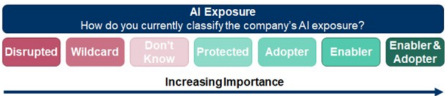
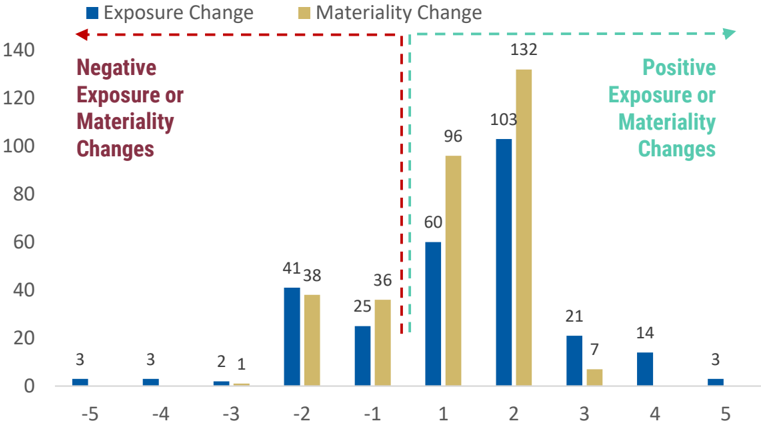
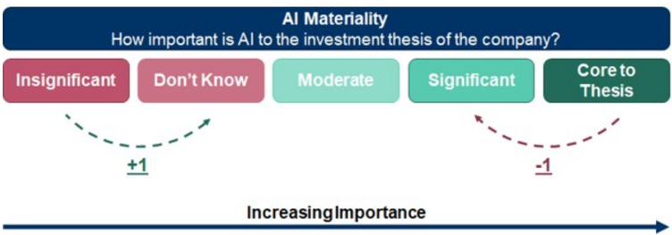
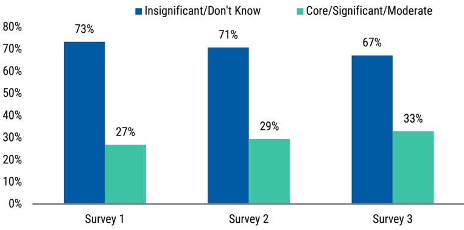

<!-- Context: Uncovering Alpha in AI's Rate of Change -->

# Page 2

<!-- BOUNDARY_START type="header" id="p2_header_1" page="2" level="1" breadcrumbs="Mapping AI's Rate of Change in Charts" -->
## Mapping AI's Rate of Change in Charts
<!-- BOUNDARY_END type="header" id="p2_header_1" -->

<!-- BOUNDARY_START type="image" id="p2_image_1" page="2" filename="fig_p2_1.png" has_caption="yes" breadcrumbs="Mapping AI's Rate of Change in Charts" -->
**Image**
*Caption:* Exhibit 2: Morgan Stanley classification for how AI Rate of Change "Exposure" is scored

*AI Analysis:* This is a diagram. It visually represents a classification system for a company's AI exposure according to Morgan Stanley.

Axes and Layout:
- Horizontal Axis: Indicates the increasing importance of AI exposure from left to right.

Key Components:
- Categories: Listed from left to right are "Disrupted," "Wildcard," "Don’t Know," "Protected," "Adopter," "Enabler," and "Enabler & Adopter."

Trends and Insights:
- The progression suggests a shift from uncertainty or minimal relevance in AI ("Disrupted," "Wildcard") to strategic and integral use of AI ("Enabler & Adopter").
- The positioning also indicates an increasing level of engagement or integration of AI within a company's operations.
<!-- BOUNDARY_END type="image" id="p2_image_1" -->

<!-- BOUNDARY_START type="paragraph" id="p2_text_1" page="2" char_count="31" word_count="4" breadcrumbs="Mapping AI's Rate of Change in Charts" -->
Source: Morgan Stanley Research
<!-- BOUNDARY_END type="paragraph" id="p2_text_1" -->

<!-- BOUNDARY_START type="image" id="p2_image_2" page="2" filename="fig_p2_2.png" has_caption="yes" breadcrumbs="Mapping AI's Rate of Change in Charts" -->
**Image**
*Caption:* Exhibit 4: Most analyst reclassifications are by multiple increments to the upside and downside

*AI Analysis:* This is a chart. 

**Axes:**
- **X-axis:** Displays the magnitude of change in increments, ranging from -5 to 5.
- **Y-axis:** Represents the number of analyst reclassifications, ranging from 0 to 140.

**Trends:**
- Most reclassifications occur at increments of +1 and +2, with significant peaks.
- Positive changes dominate, especially at increments +1 and +2.
- Exposure and materiality changes increase more on the positive side compared to negative.

**Key Insights:**
- The most common changes are +1 and +2, indicating analysts frequently reclassify by these increments.
- Positive reclassifications are more frequent than negative, suggesting an overall optimistic adjustment trend.
- Materiality changes lead at +2, indicating a focus on significant positive material changes.
<!-- BOUNDARY_END type="image" id="p2_image_2" -->

<!-- BOUNDARY_START type="paragraph" id="p2_text_2" page="2" char_count="133" word_count="21" breadcrumbs="Mapping AI's Rate of Change in Charts" -->
Source: Morgan Stanley Research; Please click here for the full excel database of >3,700 stocks mapped by AI exposure and materiality
<!-- BOUNDARY_END type="paragraph" id="p2_text_2" -->

<!-- BOUNDARY_START type="header" id="p2_header_2" page="2" level="1" breadcrumbs="Exhibit 6:" -->
## Exhibit 6:
<!-- BOUNDARY_END type="header" id="p2_header_2" -->

<!-- BOUNDARY_START type="paragraph" id="p2_text_3" page="2" char_count="143" word_count="23" breadcrumbs="Exhibit 6:" -->
AI Agent Infrastructure and Vendor plays within the Software layer - stocks in bold represent our favoured equities within the Agentic AI theme
<!-- BOUNDARY_END type="paragraph" id="p2_text_3" -->

<!-- BOUNDARY_START type="paragraph" id="p2_text_4" page="2" char_count="251" word_count="58" breadcrumbs="Exhibit 6:" -->
Source: Morgan Stanley Research; Last Price - MDB - $246, CFLT - $29, ESTC - $101, PATH - $13, APPN - $33, CRM - $332, MSFT - $423, TEAM - $250, WDAY - $252, NOW - $1073, SAP - 235, REL - £37, HUBS - $702, GTLB - $59, FRSH - $16, ASAN - $20, BOX - $31
<!-- BOUNDARY_END type="paragraph" id="p2_text_4" -->

<!-- BOUNDARY_START type="image" id="p2_image_3" page="2" filename="fig_p2_3.png" has_caption="yes" breadcrumbs="Exhibit 6:" -->
**Image**
*Caption:* Exhibit 3: Morgan Stanley classification for how AI Rate of Change "Materiality" is scored

*AI Analysis:* This visual is a chart. 

**Axes and Elements:**
- **Horizontal Axis:** Represents "Increasing Importance" of AI to the investment thesis of a company.
- **Categories:** Insignificant, Don't Know, Moderate, Significant, Core to Thesis.

**Trends and Key Insights:**
- As AI importance increases from "Insignificant" to "Core to Thesis," investment materiality improves.
- Movement to higher importance (rightward) is indicated with a "+1" suggesting positive scoring.
- Moving to lower importance (leftward) is indicated with a "-1" suggesting negative scoring.

This chart classifies the significance of AI in a company’s investment strategy and scores it accordingly.
<!-- BOUNDARY_END type="image" id="p2_image_3" -->

<!-- BOUNDARY_START type="paragraph" id="p2_text_5" page="2" char_count="31" word_count="4" breadcrumbs="Exhibit 6:" -->
Source: Morgan Stanley Research
<!-- BOUNDARY_END type="paragraph" id="p2_text_5" -->

<!-- BOUNDARY_START type="image" id="p2_image_4" page="2" filename="fig_p2_4.png" has_caption="yes" breadcrumbs="Exhibit 6:" -->
**Image**
*Caption:* Exhibit 5: Steady progress is being made by companies in conveying their investment and equity story as it relates to AI

*AI Analysis:* This visual is a chart with bar graphs. The chart compares the perception of companies' ability to convey their investment and equity stories related to AI over three surveys.

**Axes:**
- **X-axis:** Three surveys (Survey 1, Survey 2, Survey 3).
- **Y-axis:** Percentage, ranging from 0% to 80%.

**Key Insights:**
- There is a declining trend in the "Insignificant/Don't Know" category from 73% in Survey 1 to 67% in Survey 3.
- The "Core/Significant/Moderate" category is gradually increasing from 27% in Survey 1 to 33% in Survey 3.
- This indicates steady progress by companies in conveying their AI-related investment and equity stories over time.
<!-- BOUNDARY_END type="image" id="p2_image_4" -->

<!-- BOUNDARY_START type="paragraph" id="p2_text_6" page="2" char_count="133" word_count="21" breadcrumbs="Exhibit 6:" -->
Source: Morgan Stanley Research; Please click here for the full excel database of >3,700 stocks mapped by AI exposure and materiality
<!-- BOUNDARY_END type="paragraph" id="p2_text_6" -->