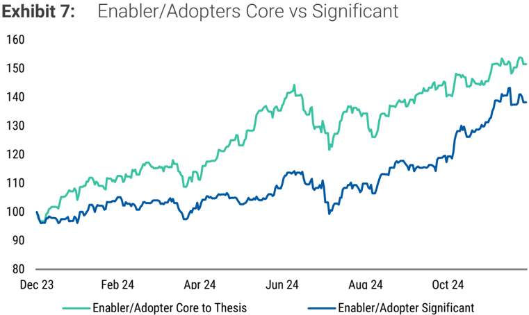
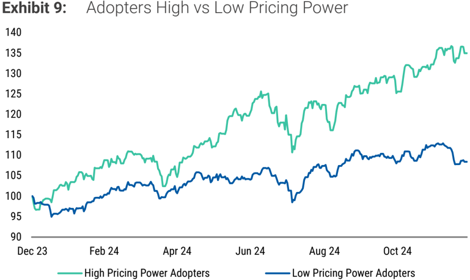
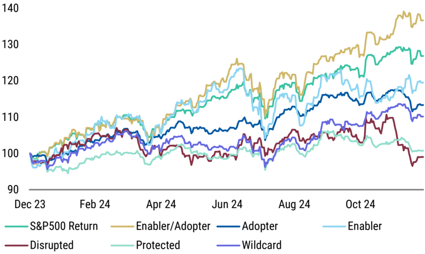
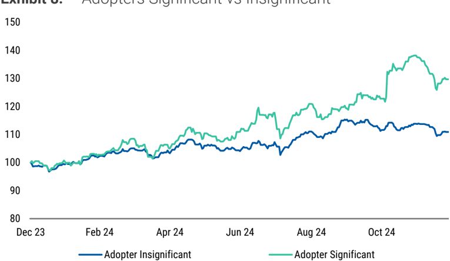
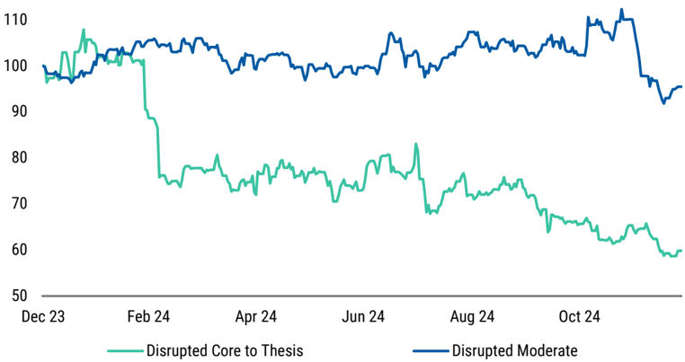
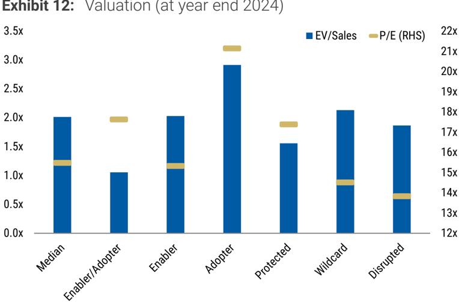

<!-- Context: Exhibit 6: -->

# Page 3

<!-- BOUNDARY_START type="header" id="p3_header_1" page="3" level="1" breadcrumbs="AI's Rate of Return in Charts" -->
## AI's Rate of Return in Charts
<!-- BOUNDARY_END type="header" id="p3_header_1" -->

<!-- BOUNDARY_START type="image" id="p3_image_1" page="3" filename="fig_p3_1.png" has_caption="yes" breadcrumbs="AI's Rate of Return in Charts" -->
**Image**
*Caption:* Source: FactSet, Morgan Stanley Research

*AI Analysis:* This is a chart comparing "Enabler/Adopters Core to Thesis" and "Enabler/Adopter Significant" over time.

**Axes:**
- **X-axis:** Timeline from December 2023 to October 2024.
- **Y-axis:** Index value ranging from 80 to 160.

**Trends:**
- Both lines start around the 100 mark but diverge in trends.
- The "Enabler/Adopters Core to Thesis" (green line) shows a general upward trend, experiencing fluctuations but steadily increasing.
- The "Enabler/Adopter Significant" (blue line) also shows growth but at a slower pace. It has more pronounced dips and peaks.

**Key Insights:**
- The "Core to Thesis" category experiences more consistent growth compared to "Significant."
- Both categories show overall positive trends, indicating growth or improvement over the timeframe.
<!-- BOUNDARY_END type="image" id="p3_image_1" -->

<!-- BOUNDARY_START type="image" id="p3_image_2" page="3" filename="fig_p3_2.png" has_caption="yes" breadcrumbs="AI's Rate of Return in Charts" -->
**Image**
*Caption:* Source: FactSet, Morgan Stanley Research

*AI Analysis:* The visual is a chart comparing "High Pricing Power Adopters" and "Low Pricing Power Adopters."

**Axes:**
- **X-axis:** Time (from December 23 to October 24).
- **Y-axis:** Index level ranging from 90 to 140.

**Trends:**
- The "High Pricing Power Adopters" (green line) consistently remains above the "Low Pricing Power Adopters" (blue line).
- The green line shows a general upward trend, with fluctuations but overall significant growth.
- The blue line shows a moderate upward trend, with less volatility and smaller growth compared to the green line.

**Key Insights:**
- Companies with high pricing power exhibit stronger growth in their index levels than those with low pricing power.
- There is a noticeable positive correlation between pricing power and performance over the time period shown.
<!-- BOUNDARY_END type="image" id="p3_image_2" -->

<!-- BOUNDARY_START type="image" id="p3_image_3" page="3" filename="fig_p3_3.png" has_caption="yes" breadcrumbs="AI's Rate of Return in Charts" -->
**Image**
*Caption:* Exhibit 11: Market cap weighted performance by AI Exposure categorisation during 2024

*AI Analysis:* The visual is a chart.

**Axes:**
- **X-axis:** Time period from December 2023 to October 2024.
- **Y-axis:** Market cap weighted performance index ranging from 90 to 140.

**Trends:**
- **Enabler/Adopter** shows the highest performance increase over time.
- **Adopter** and **Enabler** also show significant upward trends.
- **S&P500 Return** and **Protected** remain relatively stable, with minor fluctuations.
- **Wildcard** and **Disrupted** show less growth, with **Disrupted** being the lowest performer.

**Key Insights:**
- Companies classified as **Enabler/Adopter** lead in performance.
- **Disrupted** category underperforms throughout the year.
- There's a clear positive impact on performance for companies with higher AI exposure.
<!-- BOUNDARY_END type="image" id="p3_image_3" -->

<!-- BOUNDARY_START type="paragraph" id="p3_text_1" page="3" char_count="40" word_count="5" breadcrumbs="AI's Rate of Return in Charts" -->
Source: FactSet, Morgan Stanley Research
<!-- BOUNDARY_END type="paragraph" id="p3_text_1" -->

<!-- BOUNDARY_START type="image" id="p3_image_4" page="3" filename="fig_p3_4.png" has_caption="yes" breadcrumbs="AI's Rate of Return in Charts" -->
**Image**
*Caption:* Exhibit 8: Adopters Significant vs Insignificant

*AI Analysis:* The visual is a line chart.

**Axes:**
- **X-axis:** Time period from December 2023 to December 2024.
- **Y-axis:** Index value ranging from 80 to 150.

**Trends:**
- **Adopter Insignificant (blue line):** Shows a generally stable trend with slight fluctuations, maintaining between 100 and 120.
- **Adopter Significant (green line):** Exhibits a rising trend, with more noticeable fluctuations compared to the blue line. Starting around 100, it peaks above 140 by mid-2024 and remains higher than the blue line throughout most of the period.

**Key Insights:**
- "Adopter Significant" demonstrates greater growth and volatility compared to "Adopter Insignificant."
- Both lines start similarly, but "Adopter Significant" diverges and maintains a lead throughout the year.
<!-- BOUNDARY_END type="image" id="p3_image_4" -->

<!-- BOUNDARY_START type="paragraph" id="p3_text_2" page="3" char_count="40" word_count="5" breadcrumbs="AI's Rate of Return in Charts" -->
Source: FactSet, Morgan Stanley Research
<!-- BOUNDARY_END type="paragraph" id="p3_text_2" -->

<!-- BOUNDARY_START type="image" id="p3_image_5" page="3" filename="fig_p3_5.png" has_caption="yes" breadcrumbs="AI's Rate of Return in Charts" -->
**Image**
*Caption:* Exhibit 10: Disrupted Core vs Moderate

*AI Analysis:* The visual is a line chart.

**Axes:**
- **X-axis:** Timeline from December 23 to October 24, indicating months.
- **Y-axis:** Values ranging from 50 to 110.

**Trends:**
- The "Disrupted Core to Thesis" line starts near 100, fluctuates mildly, and then experiences a significant drop around February. It fluctuates until October, stabilizing around 60.
- The "Disrupted Moderate" line also starts near 100, maintains a more stable pattern, with minor fluctuations, mostly remaining above 90 until a drop near October.

**Key Insights:**
- "Disrupted Core to Thesis" shows volatility with a marked decline early in the period.
- "Disrupted Moderate" is more stable but ends with a decline in October.
- Both datasets exhibit a drop near the end, indicating possible external influencing factors affecting both metrics similarly by October.
<!-- BOUNDARY_END type="image" id="p3_image_5" -->

<!-- BOUNDARY_START type="paragraph" id="p3_text_3" page="3" char_count="40" word_count="5" breadcrumbs="AI's Rate of Return in Charts" -->
Source: FactSet, Morgan Stanley Research
<!-- BOUNDARY_END type="paragraph" id="p3_text_3" -->

<!-- BOUNDARY_START type="image" id="p3_image_6" page="3" filename="fig_p3_6.png" has_caption="yes" breadcrumbs="AI's Rate of Return in Charts" -->
**Image**
*Caption:* Source: FactSet, Morgan Stanley Research

*AI Analysis:* This visual is a chart, specifically a bar chart.

### Axes Description:
- **X-Axis:** Different categories: Median, Enabler/Adopter, Enabler, Adopter, Protected, Wildcard, Disrupted.
- **Y-Axis (Left):** EV/Sales ratio ranging from 0.0x to 3.5x.
- **Y-Axis (Right):** P/E ratio ranging from 12x to 22x.

### Key Trends and Insights:
- **EV/Sales (blue bars):** The "Adopter" category has the highest EV/Sales ratio, surpassing 3.0x. The "Protected" category has the lowest, below 1.0x.
- **P/E (gold markers):** All categories have similar P/E ratios, generally between 14x and 17x, with some variation. The highest is slightly above 17x in the "Enabler" category.

Overall, the
<!-- BOUNDARY_END type="image" id="p3_image_6" -->