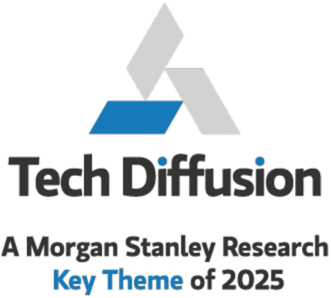

<!-- Context: AI's Rate of Return in Charts -->

# Page 4

<!-- BOUNDARY_START type="header" id="p4_header_1" page="4" level="1" breadcrumbs="Executive Summary" -->
## Executive Summary
<!-- BOUNDARY_END type="header" id="p4_header_1" -->

<!-- BOUNDARY_START type="header" id="p4_header_2" page="4" level="1" breadcrumbs="Please click here for the full excel database of >3,700 stocks mapped by AI exposure and materiality." -->
## Please click here for the full excel database of >3,700 stocks mapped by AI exposure and materiality.
<!-- BOUNDARY_END type="header" id="p4_header_2" -->

<!-- BOUNDARY_START type="paragraph" id="p4_text_1" page="4" char_count="222" word_count="38" breadcrumbs="Please click here for the full excel database of >3,700 stocks mapped by AI exposure and materiality." -->
This is the third mapping (see here and here) of our global coverage as it pertains to the speed of AI adoption. We have again asked Morgan Stanley Research analysts across the firm's global stock coverage three questions:
<!-- BOUNDARY_END type="paragraph" id="p4_text_1" -->

<!-- BOUNDARY_START type="paragraph" id="p4_text_2" page="4" char_count="118" word_count="20" breadcrumbs="Please click here for the full excel database of >3,700 stocks mapped by AI exposure and materiality." -->
How do you currently classify the company's AI exposure? 7 categories from Enabler down to Disrupted (see  Exhibit 2 )
<!-- BOUNDARY_END type="paragraph" id="p4_text_2" -->

<!-- BOUNDARY_START type="paragraph" id="p4_text_3" page="4" char_count="157" word_count="30" breadcrumbs="Please click here for the full excel database of >3,700 stocks mapped by AI exposure and materiality." -->
How material do you believe AI will be to the investment thesis in the next 1224 months? 5 categories from Core to Thesis down to Insignificant ( Exhibit 3 )
<!-- BOUNDARY_END type="paragraph" id="p4_text_3" -->

<!-- BOUNDARY_START type="paragraph" id="p4_text_4" page="4" char_count="155" word_count="25" breadcrumbs="Please click here for the full excel database of >3,700 stocks mapped by AI exposure and materiality." -->
How do you perceive this company's pricing power (i.e. ability to retain cost savings vs passing through to customers)? 3 categories of High, Neutral, Low.
<!-- BOUNDARY_END type="paragraph" id="p4_text_4" -->

<!-- BOUNDARY_START type="header" id="p4_header_3" page="4" level="1" breadcrumbs="What's New in this analysis - 5 key changes and findings" -->
## What's New in this analysis - 5 key changes and findings
<!-- BOUNDARY_END type="header" id="p4_header_3" -->

<!-- BOUNDARY_START type="paragraph" id="p4_text_5" page="4" char_count="326" word_count="54" breadcrumbs="What's New in this analysis - 5 key changes and findings" -->
275 stocks ($5.7trn of value) have changed exposure and 310 stocks ($7.8trn of value) have changed materiality. 115 stocks ($2.2trn of value) have changed both exposure and materiality. 76 have moved up in both, 16 have moved down in both. Stocks that have changed categories represent ~$14tr in market cap, $9tr in revenues .
<!-- BOUNDARY_END type="paragraph" id="p4_text_5" -->

<!-- BOUNDARY_START type="paragraph" id="p4_text_6" page="4" char_count="81" word_count="13" breadcrumbs="What's New in this analysis - 5 key changes and findings" -->
24 stocks (net) moved from Adopters to Enabler/Adopter ;   7 stocks to Disrupted.
<!-- BOUNDARY_END type="paragraph" id="p4_text_6" -->

<!-- BOUNDARY_START type="paragraph" id="p4_text_7" page="4" char_count="226" word_count="38" breadcrumbs="What's New in this analysis - 5 key changes and findings" -->
AI is now more material for 17% of Financials coverage ; Financials had the highest net AI Materiality increase across   our global coverage. Consumer Staples was at the other end of the spectrum, with net 3% lower importance.
<!-- BOUNDARY_END type="paragraph" id="p4_text_7" -->

<!-- BOUNDARY_START type="paragraph" id="p4_text_8" page="4" char_count="276" word_count="44" breadcrumbs="What's New in this analysis - 5 key changes and findings" -->
139 Adopters have been designated as having 'High Pricing Power' and have outperformed "Low Pricing Power" Adopters by 30% since ChatGPT was released. Since the last survey, our analysts have added 8 companies to the high pricing power & high AI Materiality Adopters category.
<!-- BOUNDARY_END type="paragraph" id="p4_text_8" -->

<!-- BOUNDARY_START type="paragraph" id="p4_text_9" page="4" char_count="219" word_count="36" breadcrumbs="What's New in this analysis - 5 key changes and findings" -->
3 upward materiality ratings changes made for every stock that declined in materiality . This ratio was 1.1 previously; in other words, in the last survey each upward materiality change was matched by a downward change.
<!-- BOUNDARY_END type="paragraph" id="p4_text_9" -->

<!-- BOUNDARY_START type="header" id="p4_header_4" page="4" level="1" breadcrumbs="Rate of Change Has Driven Outperformance" -->
## Rate of Change Has Driven Outperformance
<!-- BOUNDARY_END type="header" id="p4_header_4" -->

<!-- BOUNDARY_START type="paragraph" id="p4_text_10" page="4" char_count="346" word_count="56" breadcrumbs="Rate of Change Has Driven Outperformance" -->
We believe investors predominantly use our survey for three reasons: (1) to understand the rate of change in AI and its corporate adoption; (2) portfolio risk management and (3) stock-picking. We look at the performance of stocks for which our global analysts identified a change in materiality, exposure or both as part of the earlier re-mapping
<!-- BOUNDARY_END type="paragraph" id="p4_text_10" -->

<!-- BOUNDARY_START type="image" id="p4_image_1" page="4" filename="fig_p4_1.png" has_caption="no" breadcrumbs="Rate of Change Has Driven Outperformance" -->
**Image**

*AI Analysis:* This visual is a logo or title graphic. It represents "Tech Diffusion" as a key theme of 2025 according to Morgan Stanley Research. 

There are no axes, trends, or data insights to evaluate, as it's not a chart, diagram, or data table.
<!-- BOUNDARY_END type="image" id="p4_image_1" -->