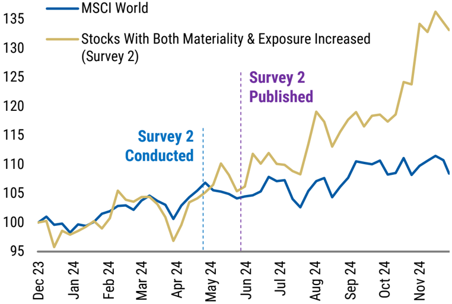
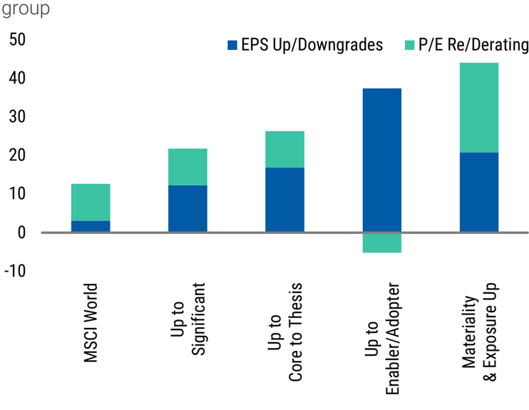

<!-- Context: Rate of Change Has Driven Outperformance -->

# Page 5

<!-- BOUNDARY_START type="paragraph" id="p5_text_1" page="5" char_count="56" word_count="10" breadcrumbs="Rate of Change Has Driven Outperformance" -->
exercise to assess the relevance of AI's rate of change.
<!-- BOUNDARY_END type="paragraph" id="p5_text_1" -->

<!-- BOUNDARY_START type="paragraph" id="p5_text_2" page="5" char_count="785" word_count="135" breadcrumbs="Rate of Change Has Driven Outperformance" -->
In our second survey, 326 stocks saw a change in AI exposure and 443 stocks saw a change in materiality, as judged by our global analysts. For simplicity, we group these changes into the most common types of re-mapping (i.e. both exposure and materiality up; only materiality increased to Core to Thesis; only exposure increased to Enabler/Adopter). Those stocks that had their exposure and materiality increased by our analysts in Survey 2 outperformed the MSCI World by 25% in 2024, with mostly over in 2H ( Exhibit 13 ). Similar upgrades and re-ratings can be seen across other groupings of changes ( Exhibit 14 ). While there are other factors at play, we believe that AI's rate of change in adoption will continue to be a differentiating factor for stocks over the course of 2025.
<!-- BOUNDARY_END type="paragraph" id="p5_text_2" -->

<!-- BOUNDARY_START type="paragraph" id="p5_text_3" page="5" char_count="123" word_count="20" breadcrumbs="Rate of Change Has Driven Outperformance" -->
Exhibit 13: Performance of stocks upgraded both in exposure and materiality in Survey 2 vs MSCI World (Market cap weighted)
<!-- BOUNDARY_END type="paragraph" id="p5_text_3" -->

<!-- BOUNDARY_START type="paragraph" id="p5_text_4" page="5" char_count="126" word_count="22" breadcrumbs="Rate of Change Has Driven Outperformance" -->
Exhibit 14: Performance of stocks reclassified in various ways in Survey 2 vs MSCI World (%) - (2H24); average stock return by
<!-- BOUNDARY_END type="paragraph" id="p5_text_4" -->

<!-- BOUNDARY_START type="image" id="p5_image_1" page="5" filename="fig_p5_1.png" has_caption="yes" breadcrumbs="Rate of Change Has Driven Outperformance" -->
**Image**
*Caption:* Source: Eikon, Morgan Stanley Research

*AI Analysis:* This visual is a line chart comparing two indices over time. 

**Axes:**
- The x-axis shows the timeline from December 2023 to November 2024.
- The y-axis represents index values ranging from 95 to 135.

**Trends:**
- The blue line represents the MSCI World index, which shows a steady increase, with fluctuations, but stays mostly within 95 to 115.
- The gold line represents "Stocks With Both Materiality & Exposure Increased" from Survey 2. This line shows a more significant upward trend, particularly after May 2024, peaking in November 2024.

**Key Insights:**
- Both indices show growth, but the gold line exhibits a sharper increase post-survey publication.
- The publication of Survey 2 appears to correlate with increased investor interest or perception of value in the stocks represented by the gold line.
- The survey's timing aligns with a noticeable divergence in the performance of the two indices.
<!-- BOUNDARY_END type="image" id="p5_image_1" -->

<!-- BOUNDARY_START type="image" id="p5_image_2" page="5" filename="fig_p5_2.png" has_caption="yes" breadcrumbs="Rate of Change Has Driven Outperformance" -->
**Image**
*Caption:* Source: Eikon, Morgan Stanley Research

*AI Analysis:* This visual is a bar chart. It displays data on "EPS Up/Downgrades" and "P/E Re/Derating" across various categories. 

- **Axes**: 
  - The y-axis represents percentages, ranging from -10 to 50.
  - The x-axis lists categories: MSCI World, Up to Significant, Up to Core to Thesis, Up to Enabler/Adopter, Materiality & Exposure Up.

- **Trends and Insights**:
  - "Materiality & Exposure Up" and "Up to Enabler/Adopter" show the highest values, especially in "EPS Up/Downgrades."
  - "MSCI World" has the lowest values overall.
  - Categories generally reflect positive growth, with significant differences in P/E re-rating except for the negative value in "Up to Enabler/Adopter."

The chart highlights the variability in EPS and P/E changes across different investor categories or strategies.
<!-- BOUNDARY_END type="image" id="p5_image_2" -->

<!-- BOUNDARY_START type="header" id="p5_header_1" page="5" level="1" breadcrumbs="Latest Rate of Change in Summary" -->
## Latest Rate of Change in Summary
<!-- BOUNDARY_END type="header" id="p5_header_1" -->

<!-- BOUNDARY_START type="paragraph" id="p5_text_5" page="5" char_count="764" word_count="126" breadcrumbs="Latest Rate of Change in Summary" -->
The changes in our analysts' tagging of stocks has a similar pattern to the last survey. The largest number of stocks to change exposure category were 44 names moving from Adopter to Enabler/Adopters (24 net). This continued to be largely driven by Utilities and Energy stocks being considered to be enabling the build out of the AI infrastructure as well as being beneficiaries of its use. 42 names also moved from "Don't Know" classification to "Adopter" - so too did 33 stocks from the "Protected" category to "Adopter" - as companies continue to craft their message to the market around their involvement in this structural theme. Similar to the last survey, the largest market cap changes were between Adopter to Enabler/Adopter and from Protected to Adopter.
<!-- BOUNDARY_END type="paragraph" id="p5_text_5" -->

<!-- BOUNDARY_START type="paragraph" id="p5_text_6" page="5" char_count="699" word_count="112" breadcrumbs="Latest Rate of Change in Summary" -->
Within these category changes, there has been a far greater concentration in changes in materiality towards (1) Enabler stocks being upgraded in materiality to Core to Thesis and (2) Adopter stocks being upgraded to Moderate   materiality by our analysts. In each case 9% of market cap of Enablers and Adopters was increased to Core to Thesis and Moderate, respectively. Collectively >$6trn of market cap was reclassified in these two ways. As we go on to elaborate, most of this   evolution and upgrading of materiality particularly for the Adopter category -   has come from Banks and Financials. This is a vertical we believe will become increasingly important through 2025, just as Utilities was
<!-- BOUNDARY_END type="paragraph" id="p5_text_6" -->