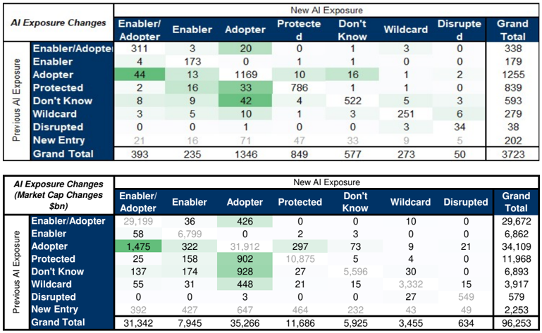
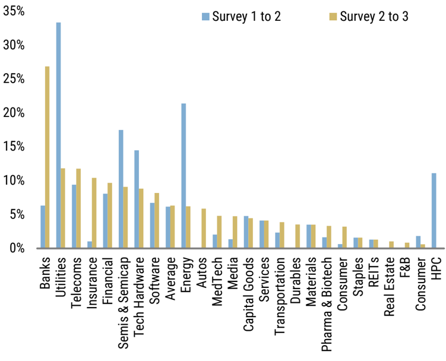

<!-- Context: Latest Rate of Change in Summary -->

# Page 6

<!-- BOUNDARY_START type="header" id="p6_header_1" page="6" level="1" breadcrumbs="through 2024." -->
## through 2024.
<!-- BOUNDARY_END type="header" id="p6_header_1" -->

<!-- BOUNDARY_START type="image" id="p6_image_1" page="6" filename="fig_p6_1.png" has_caption="yes" breadcrumbs="through 2024." -->
**Image**
*Caption:* Exhibit 15: Global Coverage Rate of Change, Stocks (upper table) and market cap changed (lower table)

*AI Analysis:* This visual contains data tables with two parts:

**Upper Table: Stocks**
- **Axes**: 
  - Horizontal: New AI Exposure categories (Enabler/Adopter, Enabler, Adopter, Protected, Don’t Know, Wildcard, Disrupted).
  - Vertical: Previous AI Exposure categories.
- **Trends**:
  - High counts in “Enabler” to “Enabler” (173) and “Adopter” to “Adopter” (1169) indicate consistency in categories.
  - Most transitions occur from "Enabler/Adopter" to other categories, especially Enabler and Adopter.
  
**Lower Table: Market Cap Changes ($bn)**
- **Axes**: 
  - Horizontal: New AI Exposure categories (same as above).
  - Vertical: Previous AI Exposure categories.
- **Trends**:
  - Significant market cap transition in “Adopter” to “Adopter” ($31,912 bn), suggesting stable market
<!-- BOUNDARY_END type="image" id="p6_image_1" -->

<!-- BOUNDARY_START type="table" id="p6_table_1" page="6" rows="19" columns="10" has_caption="yes" breadcrumbs="through 2024." -->
*Caption:* Source: FactSet, Morgan Stanley Research
| Row Lab Adopter Adopte 31,912                | Row Lab Adopter Adopte 31,912                | Disrupted 21     | Don't Know 73   | Enabler 322     | Enabler/Adopte 1,475   | Protected 297   | Wildcard 9      | Grand Total 34,109   |                 |
|:---------------------------------------------|:---------------------------------------------|:-----------------|:----------------|:----------------|:-----------------------|:----------------|:----------------|:---------------------|:----------------|
|                                              | Disrupte 3                                   | 549              | 0               | 0               | 0                      | 0               | 27              | 579                  |                 |
|                                              | Don't Kno 928                                | 0                | 5,596           | 174             | 137                    | 27              | 30              | 6,893                |                 |
|                                              | Enabler 0                                    | 0                | 3               | 6,799           | 58                     | 2               | 0               | 6,862                |                 |
|                                              | Enabler/ 426 Protecte                        | 0                | 0               | 36              | 29,199                 | 0               | 10              | 29,672               |                 |
|                                              | 902 Wildcard 448                             | 0                | 5               | 158             | 25                     | 10,875 21       | 4               | 11,968 3,917         |                 |
|                                              | New En 647                                   | 15 49            | 15 232          | 31 427          | 55 392                 | 464             | 3,332 43        | 2,253                |                 |
|                                              | Grand T 35,266                               | 634              | 5,925           | 7,945           | 31,342                 | 11,686          | 3,455           | 96,253               |                 |
|                                              | 5                                            |                  |                 |                 |                        |                 |                 |                      |                 |
|                                              |                                              | New AI Exposure  | New AI Exposure | New AI Exposure | New AI Exposure        | New AI Exposure | New AI Exposure | New AI Exposure      | New AI Exposure |
| AI Exposure Changes (Market Cap Changes $bn) | AI Exposure Changes (Market Cap Changes $bn) | Enabler/ Adopter | Enabler         | Adopter         | Protected              | Don't Know      | Wildcard        | Disrupted            | Grand Total     |
|                                              | Enabler/Adopter                              | 29,199           | 36              | 426             | 0                      | 0               | 10              | 0                    | 29,672          |
|                                              | Enabler                                      | 58               | 6,799           | 0               | 2                      | 3               | 0               | 0                    | 6,862           |
|                                              | Adopter Exposure                             | 1,475            | 322             | 31,912          | 297                    | 73              | 9               | 21                   | 34,109          |
|                                              | Protected                                    | 25               | 158             | 902             | 10,875                 | 5               | 4               | 0                    | 11,968          |
|                                              | Don't Know AI                                | 137              | 174             | 928             | 27                     | 5,596           | 30              | 0                    | 6,893           |
|                                              | Wildcard                                     | 55               | 31              | 448             | 21                     | 15              | 3,332           | 15                   | 3,917           |
|                                              | Disrupted Previous                           | 0                | 0               | 3               | 0                      | 0               | 27              | 549                  | 579             |
|                                              | New Entry                                    | 392              | 427             | 647             | 464                    | 232             | 43              | 49                   | 2,253           |
|                                              | Grand Total                                  | 31,342           | 7,945           | 35,266          | 11,686                 | 5,925           | 3,455           | 634                  | 96,253          |

*AI Analysis:* The table is an analytical summary, presumably by Morgan Stanley Research using data from FactSet, assessing the market impact and categorization of companies regarding AI exposure and adoption. The immediate goal of the table is to categorize and analyze companies based on their engagement with artificial intelligence, grouped into categories like "Enabler," "Adopter," "Protected," and others. 

**Structure:** 
The table is structured into two main sections. The first part lists categories of companies and subcategories (Disrupted, Don't Know, Enabler, Enabler/Adopter, Protected, Wildcard, etc.) associated with a specific number and strategic positioning. Each main category's market cap change (in billions of dollars) is detailed further. 

The second part outlines changes
<!-- BOUNDARY_END type="table" id="p6_table_1" -->

<!-- BOUNDARY_START type="image" id="p6_image_2" page="6" filename="fig_p6_2.png" has_caption="yes" breadcrumbs="through 2024." -->
**Image**
*Caption:* Exhibit 16: Materiality increases (% of sector's stocks upgraded) from one survey to the next

*AI Analysis:* This visual is a bar chart.

**Axes:**
- X-Axis: Represents various sectors such as Banks, Utilities, Telecoms, etc.
- Y-Axis: Shows the percentage of stocks upgraded.

**Trends:**
- From Survey 1 to 2, Banks and Utilities saw the highest percentage of upgrades.
- The overall trend shows a higher percentage of upgrades in many sectors from Survey 1 to 2 compared to Survey 2 to 3.
- The percentage generally decreases as you move from left to right across the sectors.

**Key Insights:**
- Banks had the most significant increase in materiality from Survey 1 to 2.
- The upgrades from Survey 2 to 3 are less prominent overall compared to Survey 1 to 2.
- Utilities and Telecom sectors also show notable materiality increases but less than Banks.
<!-- BOUNDARY_END type="image" id="p6_image_2" -->

<!-- BOUNDARY_START type="paragraph" id="p6_text_1" page="6" char_count="31" word_count="4" breadcrumbs="through 2024." -->
Source: Morgan Stanley Research
<!-- BOUNDARY_END type="paragraph" id="p6_text_1" -->

<!-- BOUNDARY_START type="header" id="p6_header_2" page="6" level="1" breadcrumbs="US Leadership Widens Further" -->
## US Leadership Widens Further
<!-- BOUNDARY_END type="header" id="p6_header_2" -->

<!-- BOUNDARY_START type="paragraph" id="p6_text_2" page="6" char_count="270" word_count="42" breadcrumbs="US Leadership Widens Further" -->
The US has been the global leader in Generative AI from the outset - the transformer technology itself, the competition in foundational model building, the willingness to generate the power needed and the consumer and enterprise adoption needed to reach escape velocity.
<!-- BOUNDARY_END type="paragraph" id="p6_text_2" -->

<!-- BOUNDARY_START type="paragraph" id="p6_text_3" page="6" char_count="513" word_count="83" breadcrumbs="US Leadership Widens Further" -->
Exposure: However, our latest survey of analysts does show a surprising dichotomy. In terms of the three exposures that matter most for stock performance (Enabler/Adopter, Enabler and Adopter), the US is largely on par with Europe and Japan in terms of proportion of stocks labelled as such. In fact, the US even lags behind Europe in the proportion of stocks considered Enabler/Adopters. Yet, in market cap terms, the US has double the weighting in Enabler/Adopters relative to Europe and quadruple that of APAC.
<!-- BOUNDARY_END type="paragraph" id="p6_text_3" -->

<!-- BOUNDARY_START type="paragraph" id="p6_text_4" page="6" char_count="568" word_count="95" breadcrumbs="US Leadership Widens Further" -->
Materiality: In terms of Materiality of AI to the investment case, the variances are starker still. Stocks where AI is considered at least moderately important to the investment case amount to c25% of European and APAC coverage but a meaningfully higher c40% of US coverage. In market cap terms, US stocks where AI is considered at least moderately important to the investment case represent >70% of the US market; double the level in Europe. And for the most important Core to Thesis categorisation, the US has c15x higher weighting than Europe or Japan, for example.
<!-- BOUNDARY_END type="paragraph" id="p6_text_4" -->

<!-- BOUNDARY_START type="paragraph" id="p6_text_5" page="6" char_count="407" word_count="69" breadcrumbs="US Leadership Widens Further" -->
The Rest of World catch-up argument: If there is a compelling argument for the gap to close between the US and other regions, we believe it lies in the Moderate Adopter groupings where the weighting of stocks and market value is comparable across the regions. This is also the grouping for which the rate of change argument holds most upside potential, particularly for corporate margins in Europe and Asia.
<!-- BOUNDARY_END type="paragraph" id="p6_text_5" -->