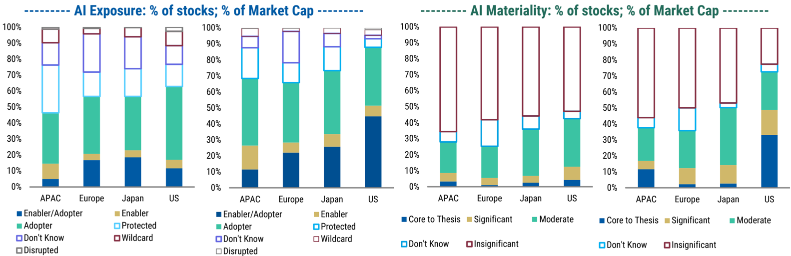
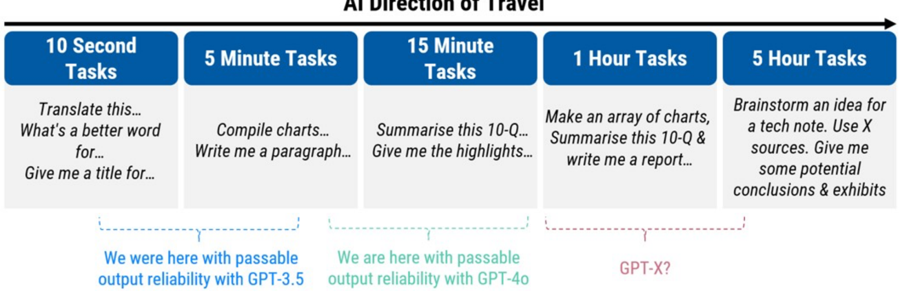

<!-- Context: US Leadership Widens Further -->

# Page 7

<!-- BOUNDARY_START type="image" id="p7_image_1" page="7" filename="fig_p7_1.png" has_caption="yes" breadcrumbs="US Leadership Widens Further" -->
**Image**
*Caption:* Exhibit 17: Proportion of stocks and market cap in each exposure and materiality category regionally

*AI Analysis:* This visual is a set of bar charts.

**Axes:**
- X-axis: Regions (APAC, Europe, Japan, US).
- Y-axis: Percentage (0% to 100%).

**Trends and Key Insights:**

1. **AI Exposure:**
   - **Enabler/Adopter** is most significant in the US, followed by APAC.
   - **Adopter** category is prominent across all regions.
   - **Enabler** category is small, with some presence in Europe and APAC.

2. **AI Materiality:**
   - **Moderate** importance is consistent across all regions.
   - **Insignificant** category dominates in APAC, Europe, and Japan.
   - The US shows a notable **Core to Thesis** population.

Overall, the charts highlight regional differences in AI stocks and market cap regarding exposure and materiality, with the US showing a higher significance in both dimensions.
<!-- BOUNDARY_END type="image" id="p7_image_1" -->

<!-- BOUNDARY_START type="paragraph" id="p7_text_1" page="7" char_count="40" word_count="5" breadcrumbs="US Leadership Widens Further" -->
Source: FactSet, Morgan Stanley Research
<!-- BOUNDARY_END type="paragraph" id="p7_text_1" -->

<!-- BOUNDARY_START type="header" id="p7_header_1" page="7" level="1" breadcrumbs="Why AI's Rate of Change Will Continue to Matter" -->
## Why AI's Rate of Change Will Continue to Matter
<!-- BOUNDARY_END type="header" id="p7_header_1" -->

<!-- BOUNDARY_START type="paragraph" id="p7_text_2" page="7" char_count="431" word_count="73" breadcrumbs="Why AI's Rate of Change Will Continue to Matter" -->
This report maps the evolution of companies' exposure to AI, how that evolution is perceived by analysts and how it is priced by the market. The reason we think this exercise is valuable to investors is because of: (1) the accelerating capabilities of foundational AI infrastructure, and (2) the fact that this technology is diffusing faster than any before it and into more industries than any before it (see here, here and here).
<!-- BOUNDARY_END type="paragraph" id="p7_text_2" -->

<!-- BOUNDARY_START type="paragraph" id="p7_text_3" page="7" char_count="530" word_count="83" breadcrumbs="Why AI's Rate of Change Will Continue to Matter" -->
Over the past 24 months, the speed of change in underlying model capabilities has ratcheted up from reliable output that can displace or supplement 5 second or 5 minute tasks, to models that are providing reliable output (i.e. minimal hallucination) for 15 minute to 1 hour tasks. The latest models focussing on inference-time reasoning (i.e. greater "thought" rather than memory regurgitation) is more compute intensive but progresses us towards the potential for 5 hour and eventually 5 day tasks being automated or streamlined.
<!-- BOUNDARY_END type="paragraph" id="p7_text_3" -->

<!-- BOUNDARY_START type="image" id="p7_image_2" page="7" filename="fig_p7_2.png" has_caption="yes" breadcrumbs="Why AI's Rate of Change Will Continue to Matter" -->
**Table/Chart**
*Caption:* Exhibit 18: Our Conceptual Roadmap for AI Developments

*AI Analysis:* This is a diagram illustrating a conceptual roadmap for AI developments.

**Axes:**
- **Horizontal Axis (AI Direction of Travel):** Represents time and task complexity from left to right, spanning from "10 Second Tasks" to "5 Hour Tasks."

**Trends and Key Insights:**
- **Task Complexity:** Increases from simple tasks like translation and finding synonyms (10 seconds) to more complex tasks like brainstorming and synthesis involving multiple sources (5 hours).
- **AI Capability Progression:** Shows past, present, and potential future capabilities of AI systems:
  - **GPT-3.5:** Achieved passable reliability for the simplest tasks (10 seconds).
  - **GPT-4.0:** Current reliable performance for more complex tasks (15 minutes).
  - **GPT-X:** Future goal, aimed at handling the most complex tasks (5 hours).

The roadmap indicates a trajectory of AI becoming capable of handling tasks of increasing complexity and duration.
<!-- BOUNDARY_END type="image" id="p7_image_2" -->

<!-- BOUNDARY_START type="paragraph" id="p7_text_4" page="7" char_count="31" word_count="4" breadcrumbs="Why AI's Rate of Change Will Continue to Matter" -->
Source: Morgan Stanley Research
<!-- BOUNDARY_END type="paragraph" id="p7_text_4" -->

<!-- BOUNDARY_START type="paragraph" id="p7_text_5" page="7" char_count="173" word_count="27" breadcrumbs="Why AI's Rate of Change Will Continue to Matter" -->
After a year of accelerating global competition in models, the latest major breakthrough was announced by OpenAI in December. The o3 Series supercedes the o1 models released
<!-- BOUNDARY_END type="paragraph" id="p7_text_5" -->